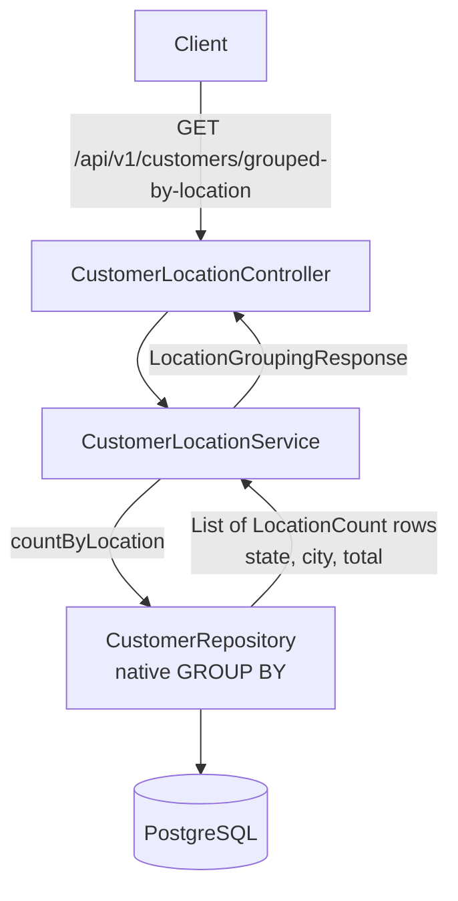

# Customer Geographic Grouping Design

**Spec**: `.specs/features/customer-geo-grouping/spec.md`
**Status**: Approved (approach A approved 2026-09-22)

---

## Architecture Overview

One native aggregate query returns one row per (state, city group). The service turns those rows into the nested response, sums state totals, and sorts. No customer entity is ever loaded.



---

## Code Reuse Analysis

### Existing Components to Leverage

| Component | Location | How to Use |
| --------- | -------- | ---------- |
| `CustomerRepository` | `customer/CustomerRepository.java` (from customer-management) | Add one native query method |
| `customer` table | Flyway `V1__create_customer.sql` | `city`, `state`, `created_at`, `id` columns; no schema change |
| `ApiExceptionHandler` | `common/web/ApiExceptionHandler.java` | Unexpected failures already map to 500 ProblemDetail (AD-003) |
| Testcontainers configuration | `src/test/java/.../TestcontainersConfiguration.java` | Reused by the integration tests (AD-001) |

### Integration Points

| System | Integration Method |
| ------ | ------------------ |
| CRUD endpoints | Tests create, update and delete customers through the existing API to check GEO-013 to GEO-015 |
| Route `/{id}` | The literal path `/grouped-by-location` is more specific than `/{id}`, so Spring MVC selects it before UUID conversion (no 400 from CUST-16) |

---

## Components

### LocationCount (projection)

- **Purpose**: One aggregate row.
- **Location**: `customer/location/LocationCount.java`
- **Interface**: `String getState()`, `String getCity()`, `long getTotal()` (Spring Data interface projection over native query aliases).

### CustomerRepository.countByLocation (query)

- **Purpose**: The single SQL statement (GEO-016) that groups and counts in the database.
- **Location**: `customer/CustomerRepository.java` (modify)

```sql
SELECT c.state                                         AS state,
       (array_agg(c.city ORDER BY c.created_at, c.id))[1] AS city,
       count(*)                                        AS total
FROM customer c
GROUP BY c.state, lower(c.city)
```

- `GROUP BY lower(city)` merges case variants (GEO-009) while keeping accents distinct (GEO-012); `state` in the key separates homonymous cities (GEO-010).
- `array_agg(... ORDER BY created_at, id)[1]` picks the spelling of the earliest-created customer (GEO-011).
- Hard delete means every row is an active customer (GEO-013 needs no filter).

### CustomerLocationService

- **Purpose**: Builds the response tree from the rows.
- **Location**: `customer/location/CustomerLocationService.java`
- **Interface**: `LocationGroupingResponse groupByLocation()` (`@Transactional(readOnly = true)`).
- **Rules**: group rows by state; state total = sum of its city totals (GEO-004); states sorted by UF (GEO-005); cities sorted with `Collator.getInstance(Locale.of("pt", "BR"))` at `PRIMARY` strength (ignores case and accents), ties broken by plain string order for determinism (GEO-006); empty rows give `states: []` (GEO-007).

### DTOs

- **Location**: `customer/location/LocationGroupingResponse.java`, `StateGroup.java`, `CityGroup.java`
- `LocationGroupingResponse(List<StateGroup> states)`, `StateGroup(String state, long totalCustomers, List<CityGroup> cities)`, `CityGroup(String city, long totalCustomers)`. No customer-level field exists in any of them (GEO-008).

### CustomerLocationController

- **Purpose**: `GET /api/v1/customers/grouped-by-location`, delegates to the service, no logic.
- **Location**: `customer/location/CustomerLocationController.java`

---

## Data Models

No schema change. The response:

```json
{ "states": [ { "state": "MG", "totalCustomers": 1,
                "cities": [ { "city": "Uberlândia", "totalCustomers": 1 } ] } ] }
```

---

## Error Handling Strategy

| Error Scenario | Handling | User Impact |
| -------------- | -------- | ----------- |
| No customers | Empty row list | 200 `{"states": []}` |
| Database failure | Propagates to `ApiExceptionHandler` | 500 ProblemDetail with the fixed detail |

---

## Risks & Concerns

| Concern | Location (file:line) | Impact | Mitigation |
| ------- | -------------------- | ------ | ---------- |
| Query is PostgreSQL-specific (`array_agg ... ORDER BY`, array subscript) | `customer/CustomerRepository.java` | Would not run on another database | Accepted: PostgreSQL is the stack; tests run on PostgreSQL (AD-001) |
| Full-table aggregate on every call | `countByLocation` | Cost grows linearly with customers | Accepted for now; see Tech Decisions on indexes and caching |
| Proving "one statement, zero entities" (GEO-016, GEO-017) | integration test | Needs Hibernate statistics | Enable `hibernate.generate_statistics` only in the test configuration |

---

## Tech Decisions (only non-obvious ones)

| Decision | Choice | Rationale |
| -------- | ------ | --------- |
| Query style | Native SQL (approach A) | Only way to pick the earliest-created spelling in one statement; JPQL `min(city)` depends on collation |
| City ordering | Java `Collator` pt-BR, not `ORDER BY` | Database collation depends on the server locale; the Collator makes GEO-006 deterministic |
| State totals | Summed in Java from the city rows | Same single statement; `GROUP BY ROLLUP` would add complexity for a trivial sum |
| Indexes | None added | The query has no `WHERE`; PostgreSQL reads every row either way, and `array_agg` over `created_at` rules out an index-only scan. An index would only slow writes. Revisit with `EXPLAIN ANALYZE` on real volume; the first candidate would be `(state, lower(city))` |
| Caching | None | No load data; premature |
