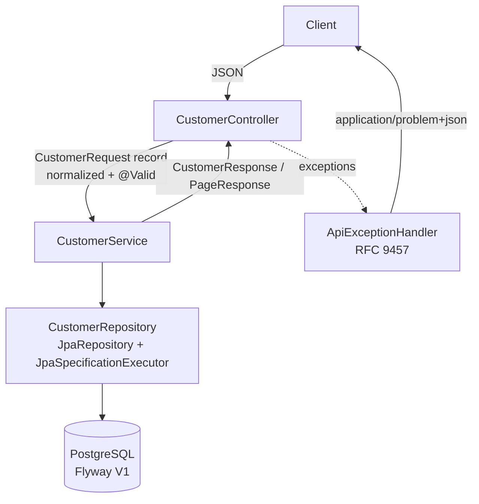

# Customer Management Design

**Spec**: `.specs/features/customer-management/spec.md`
**Status**: Approved (approach approved 2026-09-22)

---

## Architecture Overview

Classic layered Spring MVC slice, packaged by feature. The controller only binds and validates HTTP input and delegates; the service owns rules (normalization happens in the request DTO, uniqueness, timestamps, logging); the repository is Spring Data JPA; the schema comes from Flyway.



---

## Code Reuse Analysis

### Existing Components to Leverage

| Component | Location | How to Use |
| --------- | -------- | ---------- |
| Spring Boot application | `src/main/java/com/example/customerapi/CustomerApiSddApplication.java` | Unchanged entry point; feature code goes in the `customer` sub-package |
| Context test | `src/test/java/com/example/customerapi/CustomerApiSddApplicationTests.java` | Import the Testcontainers configuration so it boots against PostgreSQL |
| `ResponseEntityExceptionHandler` | Spring MVC | Base class; already maps framework exceptions (415, 400 unreadable, 400 type mismatch, 405) to ProblemDetail |
| Spring method validation | Spring MVC 7 | `@Min`/`@Max` on `page`/`size` query parameters (CUST-32) without custom code |

### Integration Points

| System | Integration Method |
| ------ | ------------------ |
| PostgreSQL | `spring.datasource.*` from environment variables (`DB_URL`, `DB_USERNAME`, `DB_PASSWORD`) with local defaults |
| Flyway | `spring-boot-starter-flyway` + `flyway-database-postgresql`; runs on startup (CUST-47) |
| Actuator | `spring-boot-starter-actuator`, only `health` exposed (CUST-43, CUST-44) |

---

## Components

All under `src/main/java/com/example/customerapi/`.

### Customer (entity)

- **Purpose**: JPA mapping of the `customer` table.
- **Location**: `customer/Customer.java`
- **Fields**: `UUID id` (assigned in constructor with `UUID.randomUUID()`), `name`, `email`, `cpf`, `phone`, `LocalDate birthDate`, `city`, `state`, `Instant createdAt`, `Instant updatedAt`, `@Version long version`.
- **Interfaces**: `Customer(CustomerData data, Instant now)`, `replaceWith(CustomerData data, Instant now)` - `updatedAt` changes, `id`/`createdAt` never do (CUST-19).

### CustomerRepository

- **Purpose**: Persistence and uniqueness look-ups.
- **Location**: `customer/CustomerRepository.java`
- **Interfaces**: `existsByEmail(String)`, `existsByCpf(String)`, `existsByEmailAndIdNot(String, UUID)`, `existsByCpfAndIdNot(String, UUID)`, plus `JpaSpecificationExecutor<Customer>` for list filters.

### CustomerRequest (DTO)

- **Purpose**: Input contract for POST and PUT; normalizes in its compact constructor so Bean Validation runs on normalized values.
- **Location**: `customer/CustomerRequest.java`
- **Normalization**: name trimmed; email trimmed + lowercased (CUST-03); cpf with `.` and `-` removed (CUST-04); city trimmed + whitespace runs collapsed (CUST-51); state trimmed + uppercased (CUST-50).
- **Constraints**: name `@NotBlank @Size(2,120)`; email `@NotBlank @Email @Size(max=254)`; cpf `@NotBlank @Cpf`; phone `@Pattern(^\+?\d{10,13}$)`; birthDate `@Past`; city `@NotBlank @Size(2,100)`; state `@NotBlank @Pattern(27 UFs)`.
- Has no `id`/`createdAt`/`updatedAt` components, so those JSON properties are ignored (CUST-13).

### Cpf / CpfValidator

- **Purpose**: Custom constraint: 11 digits, not all equal, valid check digits (CUST-07).
- **Location**: `customer/validation/Cpf.java`, `customer/validation/CpfValidator.java`
- **Interfaces**: `boolean isValid(String, ConstraintValidatorContext)`; null is valid (handled by `@NotBlank`).

### CustomerResponse / PageResponse (DTOs)

- **Purpose**: Output contracts. `CustomerResponse.from(Customer)`; `PageResponse<T>(List<T> content, PageMetadata page)` with `PageMetadata(number, size, totalElements, totalPages)` (CUST-29).
- **Location**: `customer/CustomerResponse.java`, `customer/PageResponse.java`

### CustomerSort

- **Purpose**: Parses `sort=<property>,<asc|desc>` against the whitelist `name, email, createdAt, updatedAt`; default `name,asc`; always appends `id` as a tiebreaker; unknown property or direction throws `InvalidSortException` (CUST-31, CUST-33).
- **Location**: `customer/CustomerSort.java`

### CustomerSpecifications

- **Purpose**: Builds the list filter: `lower(name) like %value%` with `%`/`_` escaped (CUST-40), `email = lower(trim(value))` (CUST-41), combined with AND (CUST-42).
- **Location**: `customer/CustomerSpecifications.java`

### CustomerService

- **Purpose**: Business rules for create, get, update, delete and list.
- **Location**: `customer/CustomerService.java`
- **Interfaces**:
  - `CustomerResponse create(CustomerRequest)` - uniqueness pre-check (409), timestamps from `Clock`, INFO log `Customer created id=<id>`.
  - `CustomerResponse get(UUID)` - 404 when absent.
  - `CustomerResponse update(UUID, CustomerRequest)` - 404 when absent (no upsert), uniqueness excluding self (CUST-22), INFO log.
  - `void delete(UUID)` - 404 when absent, INFO log.
  - `PageResponse<CustomerResponse> list(CustomerFilter, int page, int size, String sort)`.
- **Dependencies**: `CustomerRepository`, `Clock`.
- **Logging rule**: only operation + id are logged; email, cpf and phone never (CUST-45, CUST-46).

### CustomerController

- **Purpose**: HTTP binding only, base path `/api/v1/customers`.
- **Location**: `customer/CustomerController.java`
- **Interfaces**: `POST` (201 + `Location`), `GET /{id}`, `PUT /{id}`, `DELETE /{id}` (204), `GET` with `page` (`@Min(0)`), `size` (`@Min(1) @Max(100)`), `sort`, `name`, `email`. `consumes = application/json` on POST/PUT (CUST-38).

### ApiExceptionHandler

- **Purpose**: The single error contract (AD-003).
- **Location**: `common/web/ApiExceptionHandler.java`
- **Handles**: validation (400 + `errors`), `CustomerNotFoundException` (404), `DuplicateFieldException` (409 + `errors`), `DataIntegrityViolationException` with constraint `uk_customer_email`/`uk_customer_cpf` (409, CUST-12), `ObjectOptimisticLockingFailureException` (409, CUST-24), `InvalidSortException` and method-validation failures (400), any other `Exception` (500, fixed detail, CUST-39). Sets `instance` to the request path when absent (CUST-35).

### Clock and validation configuration

- **Purpose**: One UTC `Clock` bean for timestamps and for `@Past` (via `ValidationConfigurationCustomizer`, which exists in `org.springframework.boot.validation.autoconfigure` in Boot 4.1.1), so "strictly before the current UTC date" is testable with a fixed clock (CUST-09, CUST-19).
- **Location**: `common/config/ClockConfig.java`

---

## Data Models

### Table `customer` (Flyway `V1__create_customer.sql`)

```sql
CREATE TABLE customer (
    id          UUID         PRIMARY KEY,
    name        VARCHAR(120) NOT NULL,
    email       VARCHAR(254) NOT NULL,
    cpf         VARCHAR(11)  NOT NULL,
    phone       VARCHAR(14),
    birth_date  DATE,
    city        VARCHAR(100) NOT NULL,
    state       VARCHAR(2)   NOT NULL,
    created_at  TIMESTAMPTZ  NOT NULL,
    updated_at  TIMESTAMPTZ  NOT NULL,
    version     BIGINT       NOT NULL,
    CONSTRAINT uk_customer_email UNIQUE (email),
    CONSTRAINT uk_customer_cpf   UNIQUE (cpf)
);
```

Email is stored lowercased, so a plain unique constraint enforces case-insensitive uniqueness. The two unique constraints also serve the `exists*` look-ups and the `email` filter. No other index: listing sorts by name over a table with no load data yet (premature).

---

## Error Handling Strategy

| Error Scenario | Handling | User Impact |
| -------------- | -------- | ----------- |
| Invalid body fields | `MethodArgumentNotValidException` → 400 | `errors[]` with one entry per field |
| Malformed JSON | `HttpMessageNotReadableException` (framework) → 400 | ProblemDetail |
| Wrong content type | `HttpMediaTypeNotSupportedException` (framework) → 415 | ProblemDetail |
| Invalid UUID path | `MethodArgumentTypeMismatchException` (framework) → 400 | ProblemDetail |
| Unknown id | `CustomerNotFoundException` → 404 | ProblemDetail |
| Duplicate email/cpf (pre-check) | `DuplicateFieldException(field)` → 409 | `errors[]` with the field |
| Duplicate email/cpf (race) | `DataIntegrityViolationException`, constraint name → field → 409 | `errors[]` with the field |
| Concurrent update | `ObjectOptimisticLockingFailureException` → 409 | ProblemDetail; the first commit wins |
| Bad page/size | `HandlerMethodValidationException` → 400 | ProblemDetail |
| Bad sort | `InvalidSortException` → 400 | ProblemDetail |
| Anything else | `Exception` → 500 | Fixed detail, no message or stack trace |

---

## Risks & Concerns

| Concern | Location (file:line) | Impact | Mitigation |
| ------- | -------------------- | ------ | ---------- |
| Initializr pom declares H2, which conflicts with AD-001 | `pom.xml` (h2 dependency) | An unused in-memory DB on the runtime classpath could mask a missing datasource config | T1 removes it |
| `spring.jpa.open-in-view` is on by default (warning seen at startup) | `src/main/resources/application.properties:1` | Lazy loading during serialization, extra queries outside the service | T1 sets it to `false` |
| Context test boots without a database | `src/test/java/com/example/customerapi/CustomerApiSddApplicationTests.java:6` | Fails once H2 is removed | T1 imports the Testcontainers configuration |
| Spying a Spring Data repository to simulate races (CUST-12, CUST-24) | integration tests | Spies on JDK proxies can be brittle | Use `@MockitoSpyBean`, which supports Spring Data repositories; fall back to a `TransactionTemplate` interleaving if it fails |

---

## Tech Decisions (only non-obvious ones)

| Decision | Choice | Rationale |
| -------- | ------ | --------- |
| Where normalization happens | Compact constructor of `CustomerRequest` | Bean Validation must see normalized values (`" Ana@X.COM "` would fail `@Email` otherwise) |
| UUID generation | Application side in the entity constructor | The id is known before insert, so the `Location` header and log line need no flush |
| Paging parameters | Explicit `page`/`size`/`sort` parameters, not Spring's `Pageable` resolver | The resolver silently clamps out-of-range values; the spec requires 400 (CUST-32) |
| Timestamps | Set by the service from an injected UTC `Clock` | Deterministic tests for CUST-09 and CUST-19 |
| Test naming | `*Test` = unit (no Spring context), `*IntegrationTest` = Spring + Testcontainers | Lets the quick gate skip Docker-backed tests |
