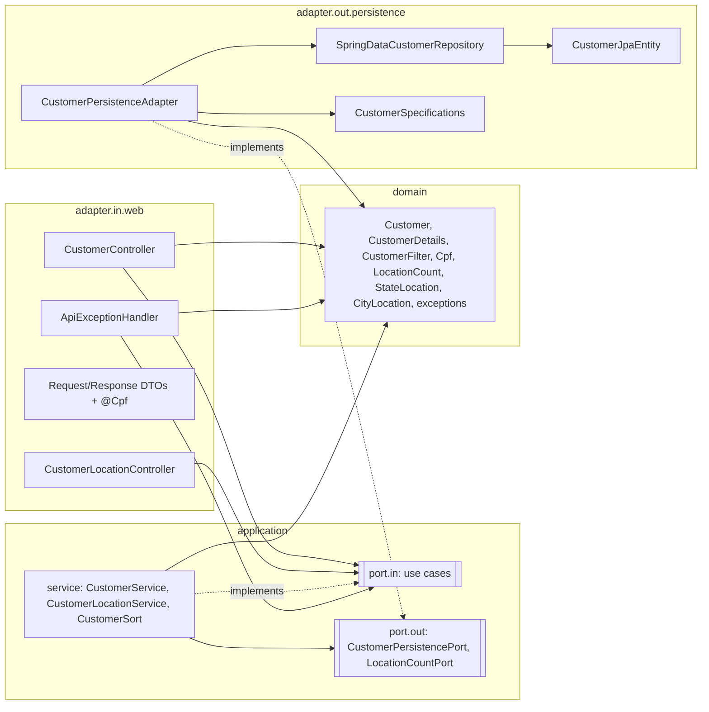

# Hexagonal Architecture Design

**Spec**: `.specs/features/hexagonal-architecture/spec.md`
**Status**: Approved (2026-09-22; the user delegated approval with Staff-level criteria)
**Decisions**: AD-005 in `.specs/STATE.md` supersedes AD-004; AD-001 to AD-003 still apply.

---

## Architecture Overview

Dependencies point inward: adapters → application → domain. Web and persistence never see each other.

---

## Code Reuse Analysis

| Existing | Becomes |
| -------- | ------- |
| `customer/Customer.java` (JPA entity) | `adapter/out/persistence/CustomerJpaEntity.java` (same mapping, same table) + new plain `domain/Customer.java` |
| `customer/CustomerRepository.java` | `adapter/out/persistence/SpringDataCustomerRepository.java` (same derived queries and native query) |
| `customer/CustomerSpecifications.java` | `adapter/out/persistence/CustomerSpecifications.java` |
| `customer/CustomerService.java` | `application/service/CustomerService.java`, implementing five `port.in` use cases on `CustomerPersistencePort` |
| `customer/location/CustomerLocationService.java` | `application/service/CustomerLocationService.java` on `LocationCountPort`, returning domain `StateLocation`/`CityLocation` |
| `customer/CustomerSort.java`, `InvalidSortException` | `application/service/CustomerSort.java`, `application/port/in/InvalidSortException.java` (part of the list use-case contract) |
| `customer/CustomerData.java` | `domain/CustomerDetails.java` (record: the editable, normalized fields) |
| `customer/CustomerFilter.java` | `domain/CustomerFilter.java` |
| `CustomerNotFoundException`, `DuplicateFieldException` | `domain/` (unchanged messages) + new `domain/ConcurrentCustomerUpdateException` |
| `customer/validation/CpfValidator` check-digit code | `domain/Cpf.isValid(String)`; `adapter/in/web/validation/CpfValidator` delegates (ARCH-03) |
| Controllers, `CustomerRequest`, `CustomerResponse`, `PageResponse`, location DTOs | `adapter/in/web/` (same JSON contract) |
| `common/web/ApiExceptionHandler` | Stays in `common.web` (cross-cutting, AD-003) and is treated as an inbound adapter; handles only domain and application exceptions |
| `common/config/ClockConfig` | Unchanged (configuration layer) |

---

## Components

All paths under `src/main/java/com/example/customerapi/customer/`.

### Domain (`domain/`, no framework imports)

- `Customer`: plain class. Fields: `id`, the `CustomerDetails` fields, `createdAt`, `updatedAt`, `version` (`long`, the optimistic-concurrency token). Factories: `register(CustomerDetails, Instant)` (new id, both timestamps) and `restore(...)` (for mapping from storage). Method: `update(CustomerDetails, Instant)` keeps `id` and `createdAt` and sets `updatedAt`.
- `CustomerDetails` record, `CustomerFilter` record, `LocationCount` record (state, city, total), `StateLocation` / `CityLocation` records (the grouping result).
- `Cpf`: `static boolean isValid(String digits)`, the check-digit algorithm.
- Exceptions: `CustomerNotFoundException`, `DuplicateFieldException(field)`, `ConcurrentCustomerUpdateException`.

### Application (`application/`)

- `port.in`: `CreateCustomerUseCase`, `GetCustomerUseCase`, `UpdateCustomerUseCase`, `DeleteCustomerUseCase`, `ListCustomersUseCase` (`Page<Customer> list(CustomerFilter, int page, int size, String sort)`), `GroupCustomersByLocationUseCase` (`List<StateLocation> groupByLocation()`), `InvalidSortException`.
- `port.out`:
  - `CustomerPersistencePort`: `findById`, `insert`, `update`, `delete`, `existsByEmail`, `existsByCpf`, `existsByEmailAndIdNot`, `existsByCpfAndIdNot`, `search(CustomerFilter, Pageable)`.
  - `LocationCountPort`: `countByLocation()`.
- `service`: `CustomerService` (`@Service @Transactional`, implements the five customer use cases, same rules and PII-free logs as before), `CustomerLocationService` (implements grouping; pt-BR Collator ordering unchanged), `CustomerSort`.

### Persistence adapter (`adapter/out/persistence/`)

- `CustomerJpaEntity` (the old entity, renamed), `SpringDataCustomerRepository`, `CustomerSpecifications`, `LocationCountRow` (interface projection for the native query).
- `CustomerPersistenceAdapter` (`@Component`, implements both output ports):
  - Maps entity to and from the domain `Customer`.
  - `update` loads the managed entity. If its version differs from the domain `version`, it throws `ConcurrentCustomerUpdateException`. Otherwise it copies the fields and calls `saveAndFlush`.
  - Translates `DataIntegrityViolationException` on `uk_customer_email` / `uk_customer_cpf` into `DuplicateFieldException`. This moves out of the web handler.
  - Translates `ObjectOptimisticLockingFailureException` into `ConcurrentCustomerUpdateException`.

### Web adapter (`adapter/in/web/`)

- `CustomerController` and `CustomerLocationController` depend only on `port.in` interfaces. They map domain results to `CustomerResponse`, `PageResponse`, `LocationGroupingResponse` / `StateGroup` / `CityGroup` (same JSON as today).
- `CustomerRequest` (Bean Validation + normalization, `toDetails()`), `validation/Cpf` + `CpfValidator`.

---

## ArchUnit rules (`src/test/java/com/example/customerapi/architecture/HexagonalArchitectureTest.java`)

| Rule | Requirement |
| ---- | ----------- |
| `..customer.domain..` depends on no `org.springframework..`, `jakarta..`, `org.hibernate..`, `..adapter..`, `..application..` | ARCH-01 |
| `@Entity` classes reside only in `..adapter.out.persistence..`; the domain has no `jakarta.persistence` annotation | ARCH-02, ARCH-10 |
| `..customer.application..` depends on no `..adapter..`, `jakarta.persistence..`, `org.hibernate..`, `org.springframework.data.jpa..`, `org.springframework.web..` | ARCH-04 |
| Classes in `..application.port.in..` / `..application.port.out..` are interfaces (or exceptions / records) | ARCH-05, ARCH-06 |
| `..application.service..` does not depend on Spring Data `Repository` types | ARCH-06 |
| `..adapter.in..` and `..common.web..` depend on no `..adapter.out..` or `..application.port.out..` | ARCH-07 |
| `..adapter.out..` depends on no `..adapter.in..` | ARCH-08 |
| Implementations of `port.out` interfaces reside in `..adapter.out..` | ARCH-09 |
| `@RestController` classes reside in `..adapter.in.web..`; Spring Data `Repository` subtypes in `..adapter.out.persistence..` | ARCH-10 |

Each rule also runs against a small set of **violation fixtures** in test sources, such as a domain class importing Spring or a controller injecting an output port. The test asserts that the rule fails for them. This proves the rules can fail.

---

## Error Handling Strategy

| Error | Where translated | Web result (unchanged) |
| ----- | ---------------- | ---------------------- |
| Unique constraint race | Persistence adapter → `DuplicateFieldException` | 409 with an `errors` entry for the field |
| Optimistic lock | Persistence adapter → `ConcurrentCustomerUpdateException` | 409 problem |
| Not found, duplicate pre-check | Application service (domain exceptions) | 404 / 409 |
| Bad sort | `CustomerSort` → `InvalidSortException` | 400 |

---

## Risks & Concerns

| Concern | Location | Impact | Mitigation |
| ------- | -------- | ------ | ---------- |
| CUST-24 (optimistic lock) could silently turn into a lost update if the adapter reloads a fresh entity | `CustomerPersistenceAdapter.update` | Data loss | Two defenses (corrected after verification). **In production** the use case runs in one transaction (enforced by an ArchUnit rule), the adapter gets back the entity the service already read, and Hibernate's versioned UPDATE plus the `ObjectOptimisticLockingFailureException` translation catch the conflict. The CUST-24 HTTP test covers this. The explicit version comparison only fires for callers outside a transaction (covered by the adapter test). With neither defense, a lost update occurs, which is why the transaction rule exists |
| The switchover (T3) touches many files in one commit | T3 | Hard review | Moves keep class bodies. Renames are mechanical. HTTP assertions are unchanged, and ARCH-11 is checked by diffing the test assertions |
| The log test asserts the abbreviated logger name `customer.CustomerService` | `OperabilityIntegrationTest.java:132` | Fails after the move | Update only the logger-name fragment to the new package. The CUST-45 assertions (one INFO line with operation and id) stay |
| The web race tests spy on the Spring Data repository | `HttpIntegrationTestSupport` | Spy type changes | The spy moves to `SpringDataCustomerRepository`. Stubs and assertions are unchanged |
| Hibernate statistics test (ARCH-12) | `CustomerLocationIntegrationTest` | Mapping could add loads | The native query still uses an interface projection, so no entities are loaded |

---

## Tech Decisions

| Decision | Choice | Rationale |
| -------- | ------ | --------- |
| Exception translation | In the persistence adapter | The web layer stops depending on Spring DAO and Hibernate constraint names. This is the adapter's job in ports and adapters |
| Concurrency token | `version` in the domain `Customer` | Makes the token explicit across the port. The live production guard is still Hibernate's versioned UPDATE inside the use-case transaction (see Risks). The explicit check protects non-transactional callers |
| Port granularity | 6 input ports (one per use case) and 2 output ports (by capability) | Use cases are the public API, so one each keeps controllers precise. Output ports are grouped by storage capability to avoid interface spam |
| One service implementing five use cases | Yes | Shared rules (uniqueness, not found). Splitting would duplicate them |
| Paging types in the application layer | Spring Data Commons `Page`/`Pageable`/`Sort` | User decision (pragmatic core). Avoids re-implementing paging |
| Error handler location | `common.web`, treated as an inbound adapter by ArchUnit | Cross-cutting contract (AD-003). Moving it would be churn without benefit |
